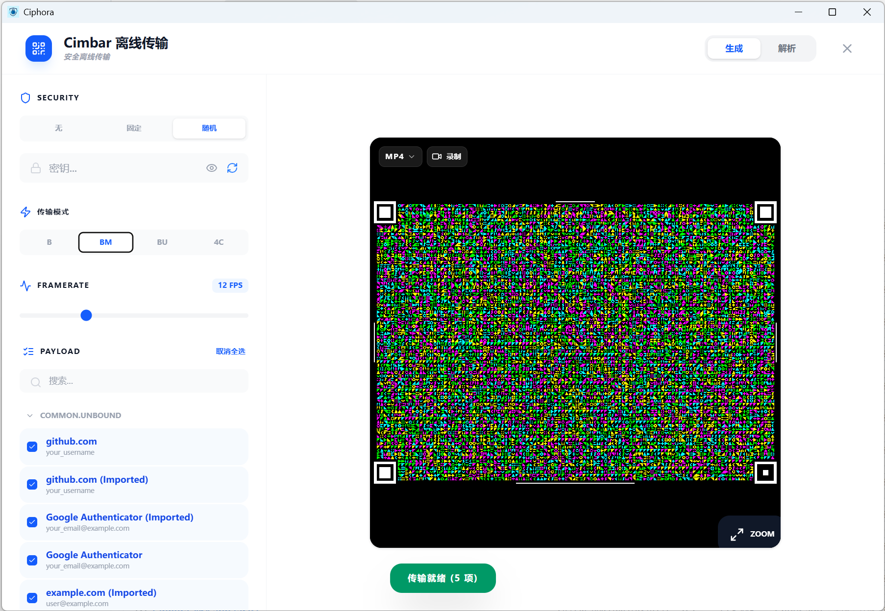

<div align="center">
  
  <h1>Ciphora</h1>
  <p>Zero-Knowledge Password Manager · Local-First · Air-Gap Transfer</p>
  <p>
    
    
    
    
    
    
  </p>
  <p>
    <a href="https://github.com/loganchef/Ciphora/releases">📦 Download</a> ·
    <a href="https://www.bilibili.com/video/BV1B61ZBgEDb/">🎬 Demo</a> ·
    <a href="https://github.com/loganchef/Ciphora/issues">🐛 Issues</a> ·
    <a href="https://github.com/loganchef/Ciphora/wiki">📖 Docs</a> ·
    <a href="./README_CN.md">🇨🇳 中文</a>
  </p>
</div>

---

## 💖 Support This Project

Ciphora is built and maintained by a single developer, entirely in spare time. No VC funding. No subscription fees. No ads. No telemetry. That's intentional — **your data should never be someone else's business model.**

If Ciphora protects your passwords, saves you from a breach, or just makes your digital life a little less stressful, please consider sponsoring. Even a one-time coffee keeps the project alive and signals that software like this is worth building.

<div align="center">

[](https://github.com/sponsors/loganchef)

</div>

WeChat Pay and Alipay also accepted:

|                     WeChat Pay                     |                     Alipay                      |
| :------------------------------------------------: | :---------------------------------------------: |
|  |  |

After sponsoring, drop a comment in [Issues](https://github.com/loganchef/Ciphora/issues) and I'll add you to the list ✨

### 🌟 Sponsors

These people make Ciphora possible. Thank you.

<table>
  <tr>
    <td align="center">
      <a href="https://github.com/sponsors/loganchef">
        <br>
        <sub><b>悟吉</b></sub>
      </a>
    </td>
    <td align="center">
      <a href="https://github.com/sponsors/loganchef">
        <br>
        <sub><b>Your Name Here</b></sub>
      </a>
    </td>
  </tr>
</table>

---

## Screenshots

<div align="center">
  <table>
    <tr>
      <td></td>
      <td></td>
    </tr>
    <tr>
      <td align="center"><sub>Secure Login</sub></td>
      <td align="center"><sub>Vault Manager</sub></td>
    </tr>
    <tr>
      <td></td>
      <td></td>
    </tr>
    <tr>
      <td align="center"><sub>Dashboard</sub></td>
      <td align="center"><sub>Settings</sub></td>
    </tr>
  </table>
</div>

---

## What is Ciphora

Most password managers ask you to trust them with your most sensitive data — then sync it to their servers, lock features behind a paywall, and reserve the right to change their privacy policy overnight.

Ciphora takes the opposite approach.

**Your vault never leaves your device.** No cloud. No sync server. No account required. Everything is encrypted locally with a key that only you can derive, and transferred to other devices through your camera — not the internet.

Beyond passwords, Ciphora stores TOTP/MFA codes, Base64 attachments, JSON structs, and free-form notes — all in the same encrypted vault. No more juggling separate apps for credentials, authenticator codes, and secure notes.

The entire cryptographic layer is written in Rust and runs in an isolated Tauri sandbox. The React frontend has zero access to keys, plaintext, or the filesystem.

---

## Why Ciphora

There are a lot of password managers. Here's how Ciphora compares in practice:

|                                     |   Ciphora   |    Bitwarden    | 1Password |   KeePass   |
| ----------------------------------- | :---------: | :-------------: | :-------: | :---------: |
| Open source                         |     ✅      |       ✅        |    ❌     |     ✅      |
| Truly local-only (no server needed) |     ✅      |  ⚠️ self-host   |    ❌     |     ✅      |
| Air-gap device sync                 |  ✅ Cimbar  |       ❌        |    ❌     |     ❌      |
| Built-in TOTP/MFA                   |   ✅ free   |     💰 paid     |  💰 paid  | plugin only |
| Rust crypto backend                 |     ✅      |       ❌        |    ❌     |     ❌      |
| Installer size                      | **< 10 MB** |     ~80 MB      |  ~100 MB  |    ~5 MB    |
| iOS + Android (same codebase)       |     ✅      |       ✅        |    ✅     |     ❌      |
| Free forever                        |     ✅      | ⚠️ limited free |    ❌     |     ✅      |

The short version: if you want a password manager that **genuinely cannot phone home** (because there's no server), with a crypto layer in a memory-safe language, that works entirely offline — Ciphora is built for that.

---

## Security Architecture

```
Master Password
      │
      ▼
PBKDF2-HMAC-SHA256  ←  device-unique salt
      │
      ▼
AES-256-GCM key
      │
      ├──► Encrypt vault → local storage
      └──► Zeroed from memory after use

Master password never stored · Data never leaves your device
```

- **Key derivation** — PBKDF2-HMAC-SHA256 with a per-device unique salt. Resistant to rainbow tables and cross-device precomputation attacks.
- **Symmetric encryption** — AES-256-GCM provides both confidentiality and integrity. Any tampering with the vault file is detected on next unlock.
- **Zero-knowledge verification** — Master password is verified against a stored hash only. The original password is never persisted or transmitted in any form.
- **Memory isolation** — Tauri's sandbox prevents frontend JavaScript from accessing the filesystem, crypto handles, or derived key material. Keys are explicitly zeroed from memory after use.

---

## Features

| Feature                        | Description                                                                            |
| ------------------------------ | -------------------------------------------------------------------------------------- |
| 🛡️ **True zero-knowledge**     | Keys derived in memory, zeroed after use. No plaintext ever touches disk.              |
| 📡 **Cimbar offline transfer** | Sync your entire vault to another device via camera. No network required, ever.        |
| 🧩 **Multi-type vault**        | Password, TOTP/MFA, Base64, JSON, Notes — one encrypted store for everything.          |
| 🔐 **Built-in MFA**            | Native TOTP generation and verification. No third-party authenticator app needed.      |
| 📂 **Group management**        | Custom groups with icons. Batch move, reorder, and organize at scale.                  |
| 📤 **Import / Export**         | JSON and CSV, compatible with 1Password, Bitwarden, KeePass, and others.               |
| 📱 **All platforms**           | Windows, macOS, Linux, Android, iOS — one codebase via Tauri.                          |
| 🌐 **i18n**                    | Full English and Chinese, auto-detects system language. More languages welcome via PR. |
| ⚡ **High performance**        | Binary serialization. Millisecond unlocks and searches on 10,000+ records.             |
| 🪶 **Ultra lightweight**       | Installer under 10 MB. Tauri, not Electron — your RAM will thank you.                  |

---

## 📡 Cimbar Offline Transfer

<div align="center">
  <table>
    <tr>
      <td></td>
      <td></td>
    </tr>
    <tr>
      <td align="center"><sub>Transfer Interface</sub></td>
      <td align="center"><sub>Dynamic Stream — BM Mode</sub></td>
    </tr>
  </table>
</div>

Ciphora integrates the [Cimbar (Color Icon Matrix Barcode)](https://github.com/sz3/libcimbar) protocol for air-gapped device sync. Here's why it matters:

**Standard QR codes max out at a few hundred bytes.** Cimbar encodes your entire encrypted vault into a continuous video stream using Fountain Codes — there's no size ceiling, and no need to split your vault into pieces.

**Dropped frames don't break the transfer.** The decoder reconstructs the original file from any sufficient subset of frames received. Move the camera away briefly, keep scanning — it picks up where it left off.

**The stream itself reveals nothing.** Transfer is completely offline. Combined with mandatory Share Password cascade encryption, your vault remains safe even if someone records the entire session.

> Powered by [libcimbar](https://github.com/sz3/libcimbar) by [sz3](https://github.com/sz3). This capability would not exist without their work.

---

## Tech Stack

| Layer         | Technology                                          |
| ------------- | --------------------------------------------------- |
| Core / Crypto | Rust 1.75+, Tauri 2.0                               |
| Crypto libs   | `aes-gcm`, `argon2`, `sha2`, `rand`                 |
| Frontend      | React 18, Vite 7, Tailwind CSS 4, Heroicons, Lucide |
| i18n          | i18next (UI + Rust backend dual-stack)              |
| MFA           | TOTP via `speakeasy` / `totp-lite`                  |
| Mobile        | Kotlin (Android), Swift (iOS) via Tauri Bridge      |

---

## Quick Start

### Download

Get the installer for your platform from [Releases](https://github.com/loganchef/Ciphora/releases):

| Platform            | File                       |
| ------------------- | -------------------------- |
| Windows x64         | `Ciphora_*_x64-setup.exe`  |
| Windows x86         | `Ciphora_*_x86-setup.exe`  |
| macOS Apple Silicon | `Ciphora_*_aarch64.dmg`    |
| macOS Intel         | `Ciphora_*_x64.dmg`        |
| Linux               | `Ciphora_*_amd64.AppImage` |
| Android             | `Ciphora_*.apk`            |

### Build from Source

**Requirements**: Node.js 18+, Rust 1.75+, [Tauri prerequisites](https://tauri.app/start/prerequisites/)

```bash
git clone https://github.com/loganchef/Ciphora.git
cd Ciphora
npm install

# Desktop
npm run tauri:dev           # development with hot reload
npm run tauri:build         # production build

# Android
npm run tauri:android:init
npm run tauri:android:build

# iOS (macOS + Xcode required)
npm run tauri:ios:init
npm run tauri:ios:build
```

---

## Roadmap

Planned features and directions. Watch Releases to follow progress.

- [ ] Browser extension for autofill
- [ ] Yubikey / hardware key support
- [ ] Vault history and non-destructive edits
- [ ] Password-protected encrypted export (ZIP)
- [ ] More languages (contributions welcome)
- [ ] Emergency access / trusted contact unlock

Have a feature request? [Open an issue](https://github.com/loganchef/Ciphora/issues) — community feedback directly shapes what gets built next.

---

## FAQ

**Is my data safe if I lose my device?**

Your vault file is AES-256-GCM encrypted with a key derived from your master password. Without the password, the file is unreadable — even to you. Keep a backup copy of the vault file somewhere physically safe. Even if someone finds it, they can't open it.

**What happens if I forget my master password?**

There is no recovery mechanism, by design. Zero-knowledge means there's no server that can reset your access. Write your master password down and store it somewhere physically secure (a safe, a sealed envelope, etc.).

**Can I sync across devices without Cimbar?**

Yes. You can copy the vault file via USB, local network share, AirDrop, or any transfer method you trust. Cimbar is the built-in solution for when you want to avoid any file transfer infrastructure entirely.

**Why Rust instead of JS crypto libraries?**

JavaScript runtimes have well-documented issues with secret management — garbage collection doesn't guarantee memory zeroing, and the runtime environment is more exposed. Rust gives us explicit memory control, `zeroize` on drop, and a hard sandbox boundary between crypto operations and the UI layer.

**Is the mobile app the same codebase as desktop?**

Yes. Ciphora uses Tauri's mobile bridge, sharing the Rust crypto core and React frontend across all platforms. Android and iOS have the same feature set as desktop with no separate development track.

---

## Contributing

Pull requests are welcome.

- **Bug fixes and translations** can be submitted directly
- **New features** — please open an issue first to align on scope
- **Security issues** — report privately via [GitHub Security Advisories](https://github.com/loganchef/Ciphora/security/advisories)

---

## License

[MIT License](./LICENSE) · Copyright © 2025 Ciphora

<div align="center">
  <br>
  <b>Made with ❤️ by <a href="https://github.com/loganchef">loganchef</a></b><br>
  <sub>If Ciphora helps you, a ⭐ is the best free support you can give.</sub>
</div>
